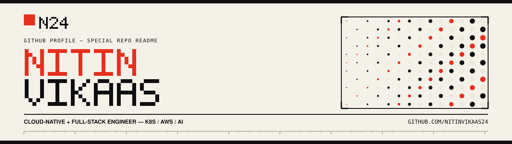
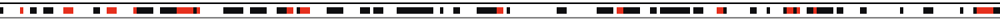
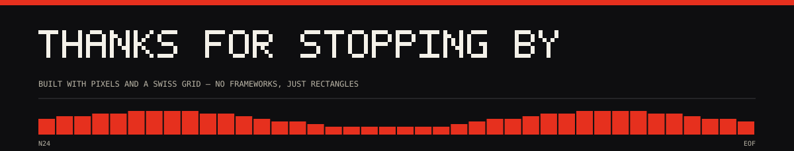

 

 

  

I'm Nitin — a final-year Computer Science undergrad who builds cloud-native infrastructure and
full-stack systems. Most of my work sits at the intersection of Kubernetes, AWS, and reliability:
fault-tolerant deployment pipelines with automated chaos engineering, serverless REST APIs, and the
OS/systems fundamentals underneath them. This profile follows the same instinct — every graphic below
is generated, not designed by hand, and the **Pipeline** section further down deploys itself.

<!-- ✏️ Swap the paragraph above for your own bio. Keep it to 2–4 lines — the grid reads best short. -->

 
Built <strong>Snappy</strong> — a real-time voice + screen assistant on the Gemini API — in 24 hours.

 

 

  

**Software Development Intern** — Krish Hortus Agri Tech Pvt. Ltd.
 IIT Madras–incubated startup · Tamil Nadu, India · Sep 2025 – Jun 2026

Engineered a serverless tree-identification platform on the PlantNet API, AWS Lambda, and API Gateway.
Added multilingual botanical insights for non-technical, regional-language users via Amazon Bedrock
(Claude Haiku), plus GPS-based registration and geospatial discovery with Leaflet.js and H3 spatial
indexing.

 

**Technical Team Member, Backend** — CEG Tech Forum
 ISO-certified student technical organisation · Chennai, India · Dec 2024 – Mar 2025

Built the core CGPA-calculation logic and college-portal integration for **CEG Sync**, a student utility
platform, in Node.js — showcased at Kurukshetra's Technovation '24 inter-college tech fest.

 

**Marketing & Media Organiser** — CEG Tech Forum
 Sep 2025 – Apr 2026

Led digital marketing and media coverage for 10+ technical events, running social strategy and
student-outreach campaigns.

 

 

  

LANGUAGES &amp; FRAMEWORKS
  

  
CLOUD, DATA &amp; AI
  

<!-- ✏️ Add/remove badges freely — https://shields.io/badges — just keep labelColor=0E0E10 and logoColor=E6301E to match the grid. -->

 

 

  

<table>
<tr>
<td width="33%" valign="top">

**[FileMind](https://github.com/Nitinvikaas24?tab=repositories&q=FileMind)**
 Python · FAISS · Ollama · Streamlit

Local RAG file-intelligence assistant — chunks, embeds, and retrieves your documents, then answers in
natural language through a locally-run model. Nothing leaves the machine.

</td>
<td width="33%" valign="top">

**[Sentinel-X](https://github.com/Nitinvikaas24/sentinel-x)**
 Python · Kubernetes · Chaos Mesh · React · Flask

Autonomous chaos-driven deployment validation — a 3-pod A/A/B design (dual baselines + canary) that
promotes or rolls back on latency, error-rate, and variance thresholds. No manual go/no-go calls.

</td>
<td width="33%" valign="top">

**[Traffic Manager](https://github.com/Nitinvikaas24?tab=repositories&q=Traffic+Manager)**
 React · Node.js · MongoDB · JWT

Real-time traffic-signal management platform with JWT badge-ID auth for secure remote override, and
Mapcn-based geospatial visualization with time-based scheduling.

</td>
</tr>
</table>

<!-- ✏️ Sentinel-X links straight to the repo. FileMind/Traffic Manager link to a search-in-repos query
     until you confirm their exact repo names — swap in direct links once you know the slugs. -->

 

 

  

The instinct behind Sentinel-X — automate the decision, don't hand-run it — applies to this page too.
A GitHub Action runs daily, reads this profile's real contribution graph, and renders it as a snake
eating its way across the grid, in the same palette as everything above. Nothing below is a
screenshot; it redeploys itself every day.

<picture>
  <source media="(prefers-color-scheme: dark)" srcset="https://raw.githubusercontent.com/Nitinvikaas24/Nitinvikaas24/output/github-contribution-grid-snake-dark.svg" />
  <source media="(prefers-color-scheme: light)" srcset="https://raw.githubusercontent.com/Nitinvikaas24/Nitinvikaas24/output/github-contribution-grid-snake.svg" />
  
</picture>

  

<!-- ✏️ One-time setup required — see .github/workflows/snake.yml and the setup notes that came with this file.
     Until the workflow runs once, the image above will show as broken; that's expected. -->

 

 

  

 

  

<!-- the contribution graph is already a pixel grid — it fits the theme for free. -->

 

 

  

<!-- ✏️ Add more, same pattern — swap URL + logo name (linkedin, x, devdotto, medium…):

-->
<!-- Phone number from the resume is deliberately left off this public page — add it only if you want it world-readable. -->

  

 

